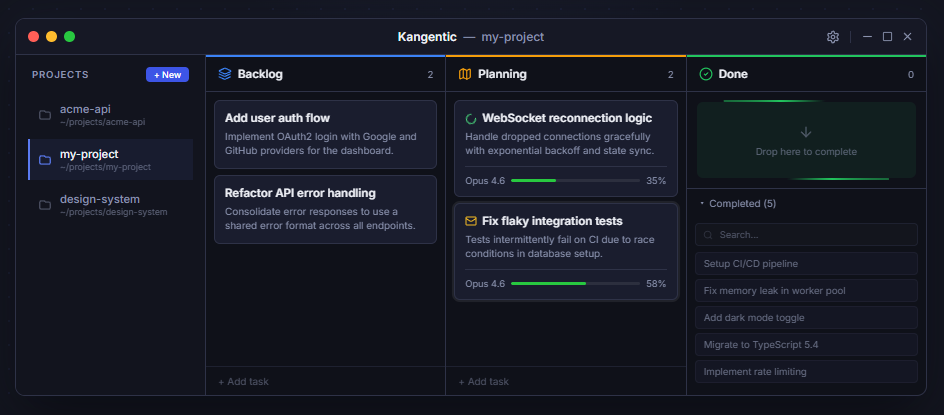

<p align="center">
  <a href="https://www.kangentic.com"></a>
</p>

<h1 align="center"><a href="https://www.kangentic.com">Kangentic</a></h1>

<p align="center">
  <strong>Kanban Orchestration for AI Coding Agents</strong>
</p>

<p align="center">
  <a href="https://www.npmjs.com/package/kangentic"></a>
  <a href="https://github.com/Kangentic/kangentic/releases/latest"></a>
  <a href="LICENSE"></a>
  
  <a href="https://www.kangentic.com"></a>
  <a href="https://www.youtube.com/watch?v=jviSrT47F0o"></a>
  <a href="https://github.com/Kangentic/kangentic/stargazers"></a>
</p>

---

<p align="center">One board for any coding agent. Drag tasks to spawn sessions, see real-time status, and ship work in parallel from native terminals on your desktop.</p>

<p align="center">AI coding agents can build features, fix bugs, and refactor entire modules autonomously. With git worktrees you can run many of them in parallel, but now the bottleneck is <strong>you</strong>: juggling terminals across projects to track which agents are stuck, finished, or waiting for approval. Kangentic replaces that with a Kanban command center. One board shows every agent's status, output, and progress. Respond when needed; let them work autonomously the rest of the time.</p>

<p align="center">
  <a href="https://www.kangentic.com"></a>
</p>
<p align="center">
  <a href="https://www.youtube.com/watch?v=jviSrT47F0o"></a>
</p>

## Features

- **Backlog, labels & priorities** - stage work in a dedicated backlog before it hits the board. Tag items with custom labels and colors, rank them on a fully-customizable priority scale, and batch-promote a week's worth of work to any column in one move.
- **Customizable workflows** - build pipelines like Plan, Execute, Review. Set permission modes, auto-commands, and transition actions per column. Configure a plan-exit target so cards advance automatically after planning, inject prompts on column entry, and chain scripts or PRs on the way out.
- **Real-time status** - see which agents are thinking or idle right on the card, with per-agent activity detection via native hooks where available and PTY fallbacks where not. Desktop notifications fire when an agent needs your attention.
- **Agent-to-board tools** - every running session has MCP tools to create tasks, move cards, search prior sessions, and queue follow-up work, so a planning agent can hand a backlog to an executing agent without you touching the board.
- **Git worktrees & review** - each agent runs in its own git worktree for parallel development without branch conflicts. When work is ready, the built-in Changes panel opens a split or inline diff viewer with file tree and untracked files, one click from the task card.
- **Session persistence** - sessions survive restarts and crashes. Orphaned sessions are detected on startup and resumable. Suspend to Done, resume later with full context, nothing is lost.
- **Handoff context** - hand work between agents without losing context. When a card moves from a Claude plan column to a Codex execute column, the next agent starts with the full history of what came before. Supported in both directions for Claude, Codex, Gemini, Qwen, Kimi, and OpenCode.
- **Terminal & activity log** - a built-in terminal for every session, plus a structured activity log that shows what each agent is doing without the noise.
- **Embedded browser** - point a sandboxed Chromium pane at any URL inside the task dialog, draw annotations, pick DOM elements, and submit the rendered frame plus context to the active agent as a multi-modal prompt, all without leaving the task.
- **Global search palette** - one overlay (Ctrl+Shift+F) searches across tasks, backlog items, session events, and projects (current project or all projects). Selecting a session-event hit jumps the Activity Log to the matched event.
- **Per-column & per-task model overrides** - pin Plan to opus, Execute to gpt-5-codex, Review to a cheaper model. Kangentic live-applies model and effort changes via the agent's `/model` and `/effort` slashes when sessions cross a column boundary.
- **Cross-platform & local** - runs entirely on your desktop on Windows, macOS, Linux, and WSL. No cloud service, no data leaves your machine. Uses the agent CLIs you already have installed.
- **Your CLIs, your way** - no OAuth flows, no wrappers, no API proxies. Kangentic launches native Claude Code, Codex, Gemini, Qwen Code, Kimi Code, OpenCode, Droid, Cursor, Copilot, Aider, and Warp terminals. Your logins, your subscriptions or API keys. Just the real CLIs, the way each vendor intended.

## How It Works

1. **Add tasks** to your board, describing the work in plain text
2. **Drag a task** into an active column. Kangentic spawns an agent in an isolated git worktree.
3. **Watch progress** in the built-in terminal, or let it run and check back later
4. **Review and merge** when the agent finishes

## Supported Agents

Run any of these coding agent CLIs from a single Kanban board:

| Agent | Status |
|-------|--------|
| [Claude Code](https://docs.anthropic.com/en/docs/claude-code) | Supported |
| [Codex CLI](https://developers.openai.com/codex/cli) | Supported |
| [Gemini CLI](https://github.com/google-gemini/gemini-cli) | Supported |
| [Qwen Code](https://github.com/QwenLM/qwen-code) | Supported |
| [Cursor CLI](https://cursor.com/docs/cli/overview) | Supported |
| [GitHub Copilot CLI](https://docs.github.com/en/copilot/how-tos/copilot-cli/cli-getting-started) | Supported |
| [OpenCode](https://opencode.ai/docs) | Supported |
| [Aider](https://aider.chat/) | Supported |
| [Oz CLI](https://docs.warp.dev/reference/cli/cli) (Warp) | Supported |
| [Kimi Code](https://github.com/MoonshotAI/kimi-cli) | Supported |
| [Droid](https://docs.factory.ai/cli/getting-started/overview) (Factory) | Supported |

## Supported Boards

Bring your own backlog. Import issues, project cards, and work items from the tools your team already uses:

| Board | Status |
|-------|--------|
| GitHub Issues | Supported |
| GitHub Projects | Supported |
| Azure DevOps | Supported |
| Asana | Supported |
| Jira | Coming soon |
| Linear | Coming soon |
| Trello | Coming soon |

## Prerequisites

- [Node.js](https://nodejs.org/) 20+ (for npx)
- [Git 2.25+](https://git-scm.com/)
- At least one supported agent CLI (see [Supported Agents](#supported-agents))

## Setup

```bash
npx kangentic
```

One command to download, install, and launch. After the first run, auto-updates handle everything.

For more details, see the [Installation & Setup guide](https://www.kangentic.com/getting-started/).

## Documentation

Get started at [kangentic.com/getting-started](https://www.kangentic.com/getting-started/).

## Development

Building from source requires Node.js 22+ (the npx floor above is for end users running the
launcher).

```bash
git clone https://github.com/Kangentic/kangentic.git
cd kangentic
npm install
npm start
```

See [CONTRIBUTING.md](CONTRIBUTING.md) for project structure, testing, and conventions.

## Contributing

See [CONTRIBUTING.md](CONTRIBUTING.md) for guidelines. All contributors must sign a [CLA](CLA.md) before their first PR can be merged.

## Support

- [GitHub Discussions](https://github.com/Kangentic/kangentic/discussions) for questions and feature requests
- [GitHub Issues](https://github.com/Kangentic/kangentic/issues) for bug reports

## License

[AGPL-3.0](LICENSE). If AGPL doesn't work for you, drop us a line at licensing@kangentic.com.

---

<h4 align="center">Built with</h4>

<p align="center">
  
  
  
  
  
  
  
  
</p>
